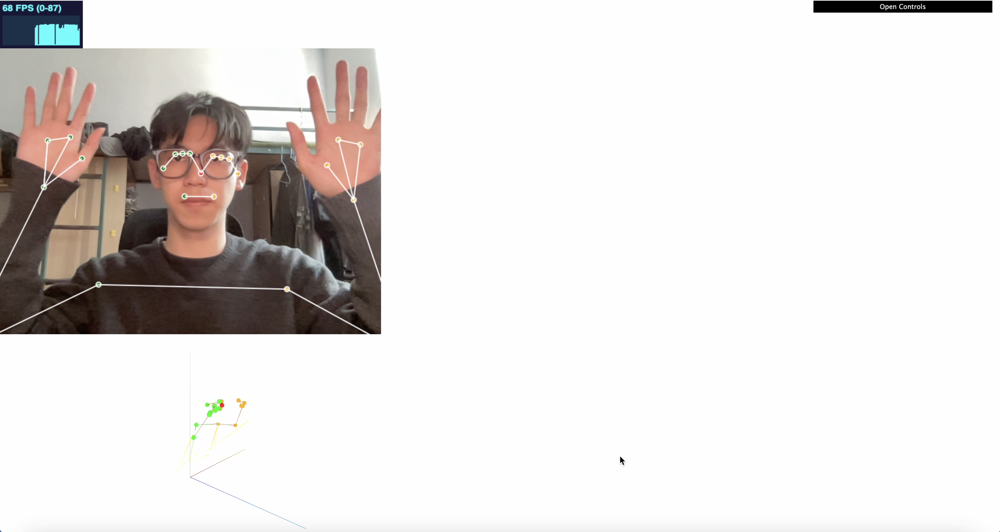
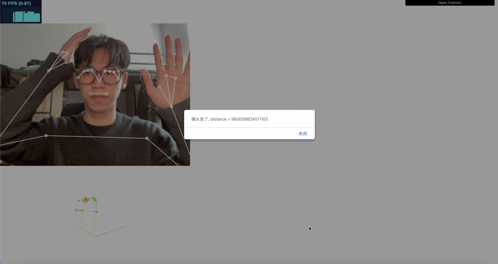

## 项目简介
由于本人思考或者学习的时候就很喜欢抓头发，此项目的目的就是为了制作出一款应用监测摸头发这个动作，一旦摸头发就发出警告。

本项目基于tensorflow训练肢体监测模型，并在web上使用tensorflow.js利用训练好的模型进行监测，当肢体的每个结点呈现摸头发动作的特征，便进行警告。

## 如何运行
1. 进入项目文件夹

2. 清除缓存 `rm -rf .cache dist node_modules`

3. 构建依赖文件 `yarn build-dep`

4. 安装依赖 `yarn`

5. 运行微博应用 `yarn watch`

6. 用浏览器打开 `localhost:1234/?model=blazepose`.

